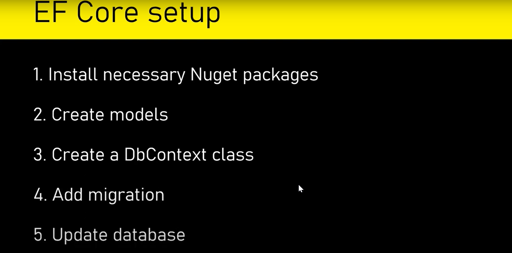
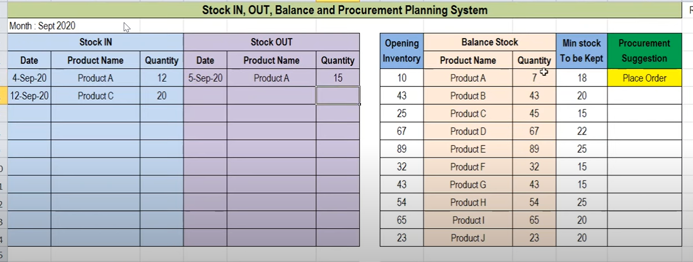

# InventoryTracking

Building an application for Stock In, Stock Out, Balance, and Procurement Planning involves various components, including models, controllers, views, and business logic. 

### Step 1: Create a new .net Core Project

```
 dotnet new mvc -n InventoryManagement
cd InventoryManagement
```
### Step 2: Install Entity Framework Core Packages

```
dotnet add package Microsoft.EntityFrameworkCore.SqlServer
dotnet add package Microsoft.EntityFrameworkCore.Design
dotnet restore
```
### Step 3: Set Up Models

```
// Models/Stock.cs
public class Stock
{
    public int Id { get; set; }
    public int ProductId { get; set; }
    public Product Product { get; set; }
    public int Quantity { get; set; }
    public DateTime TransactionDate { get; set; }
    public StockTransactionType TransactionType { get; set; }
}

// Models/Procurement.cs
public class Procurement
{
    public int Id { get; set; }
    public int ProductId { get; set; }
    public Product Product { get; set; }
    public int Quantity { get; set; }
    public DateTime PurchaseDate { get; set; }
}

// Models/Product.cs
public class Product
{
    public int Id { get; set; }
    public string Name { get; set; }
    // Add more product details as needed
}

public enum StockTransactionType
{
    In,
    Out
}
```
### Step 4: Set Up DbContext
Update the DbContext (Data/AppDbContext.cs) to include the new models:
```
// Data/AppDbContext.cs
public class AppDbContext : DbContext
{
    public AppDbContext(DbContextOptions<AppDbContext> options) : base(options) { }

    public DbSet<Stock> Stocks { get; set; }
    public DbSet<Procurement> Procurements { get; set; }
    public DbSet<Product> Products { get; set; }
}
```


### Step 5: Apply Database Migrations
Run the following commands in the terminal or Package Manager Console:

```
dotnet ef migrations add InitialCreate
dotnet ef database update
```
### Step 6: Create Controllers and Views
Generate or manually create controllers and views for Stock, Procurement, and Product. Use scaffolding or create them manually.

### Step 7: Add Business Logic
Implement business logic for Stock In, Stock Out, Balance, and Procurement Planning in your controllers. For example, you may want to calculate the current stock balance based on Stock In and Stock Out transactions.

### Step 8: Test and Enhance
Run your application and test the new features. Enhance your application based on specific requirements, such as adding validation, improving the user interface, and implementing procurement planning algorithms.

### Step 9: Implement Procurement Planning
If needed, implement procurement planning logic to automatically generate procurement suggestions based on the current stock levels and future demand.

### Step 10: Additional Features
Consider adding features like:

User authentication and authorization for secure access.
Reporting and analytics to track stock trends.
Integration with external systems or APIs for real-time data updates.
Notifications for low stock levels or procurement suggestions.
Remember that this is a basic setup, and the actual implementation may vary based on your specific needs and the complexity of the application. Regularly update and improve your application based on user feedback and evolving business requirements.



## N.B
### Update Controllers
In each controller (StockController.cs, ProcurementController.cs, and ProductController.cs), you can add or modify actions as needed. For example, you might want to add logic to calculate stock balances or handle procurement planning.

## Update Views
Customize the views in the Views/Stock, Views/Procurement, and Views/Product folders based on your application's design and requirements.

## Test The Application
Run your application (dotnet run) and navigate to the Stock, Procurement, and Product pages to test the CRUD operations.

## Enhance and Add Features
Enhance your controllers and views based on the application's specific needs. Add validation, improve the user interface, and implement any additional features required for your Stock, Procurement, and Product management system.

## Implement Procurement Planning Logic
If needed, implement procurement planning logic in your controllers to generate procurement suggestions based on current stock levels and future demand.

Regularly test and refine the application based on user feedback and evolving business needs.


